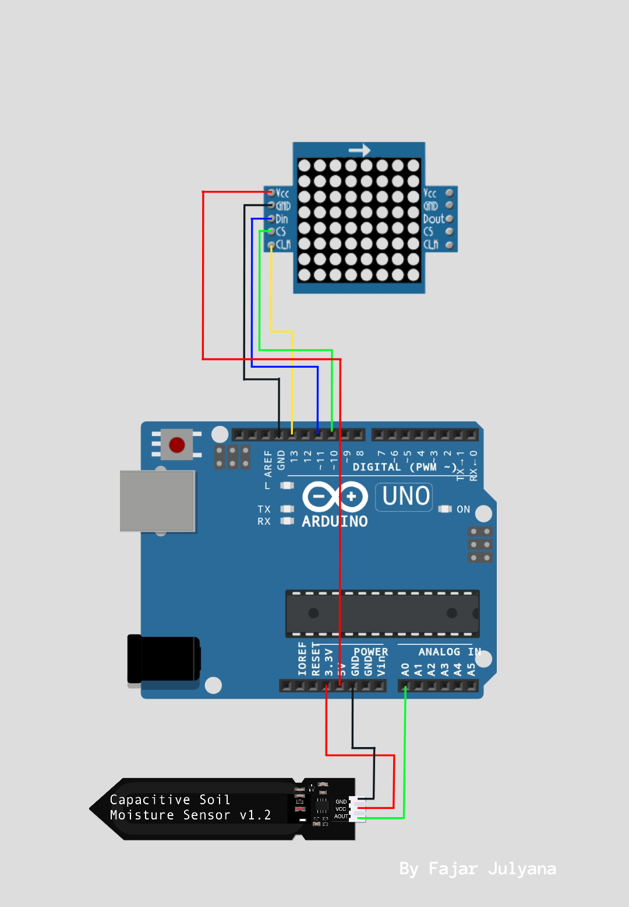
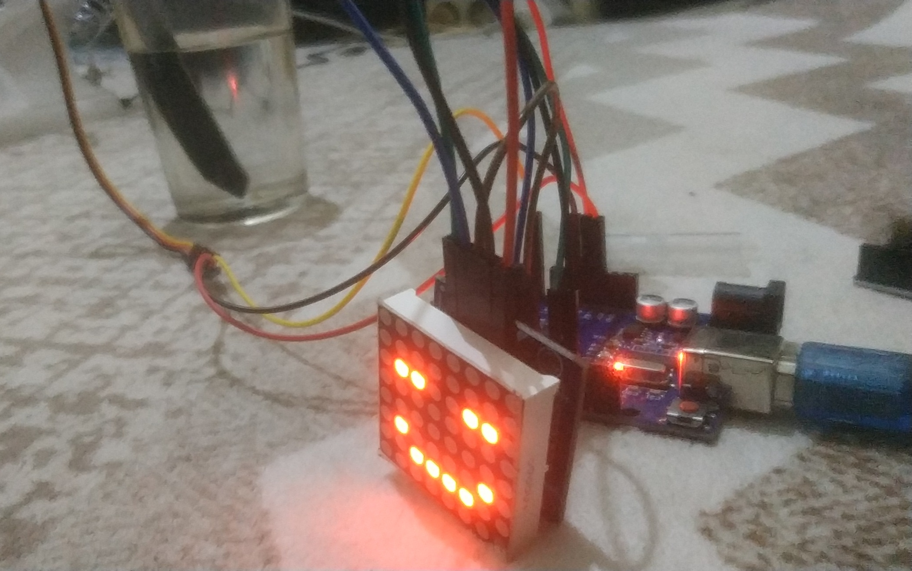
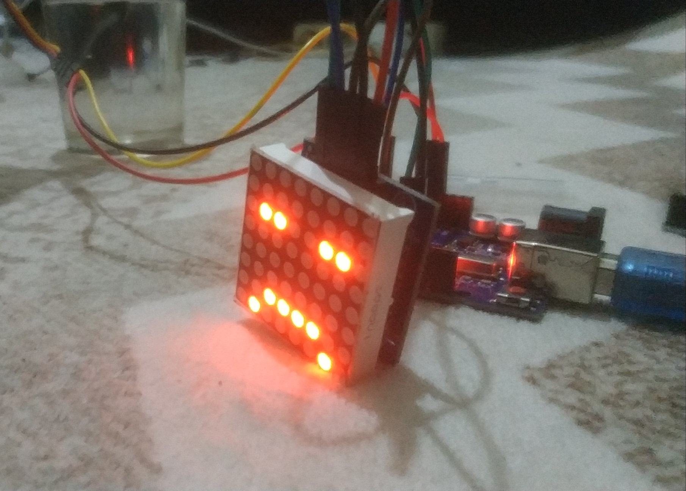

# Capasitive-soil-moisture-emoticon-face-arduino-uno
Tell you the water in pot 

a prototipe tool to measure the water content in plants, and tell you emotionally lacking water with angry and happy expressions when the water content in the pot is full then he smiles and if the water content is low and dry he is angry

## Necessary materials
1. Arduino Uno
2. MAX7219 8x8 LED DOT MATRIX DISPLAY MODULE
3. Capasitive Soil Moisture Sensor
4. Jumper Wire

## Wiring

Wiring Diagram

## Code
add library ledcontrol https://downloads.arduino.cc/libraries/github.com/wayoda/LedControl-1.0.6.zip  
and load compile upload this code to your projects
https://github.com/fajarjulyana/Capasitive-soil-moisture-emoticon-face-arduino-uno/blob/98c75cf6edfd9a23a326416629e8c3685b671214/src/code.cpp#L6-L119
# Documentation

